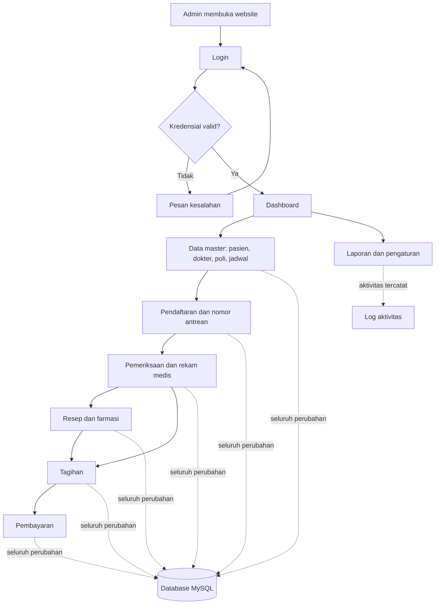

# Alur Sistem SIMRS


```mermaid
flowchart TD
    A[Admin membuka website] --> B[Login]
    B --> C{Kredensial valid?}
    C -- Tidak --> D[Pesan kesalahan]
    D --> B
    C -- Ya --> E[Dashboard]
    E --> F[Data master: pasien, dokter, poli, jadwal]
    F --> G[Pendaftaran dan nomor antrean]
    G --> H[Pemeriksaan dan rekam medis]
    H --> I[Resep dan farmasi]
    H --> J[Tagihan]
    I --> J
    J --> K[Pembayaran]
    E --> L[Laporan dan pengaturan]
    F -. seluruh perubahan .-> M[(Database MySQL)]
    G -. seluruh perubahan .-> M
    H -. seluruh perubahan .-> M
    I -. seluruh perubahan .-> M
    J -. seluruh perubahan .-> M
    K -. seluruh perubahan .-> M
    L -. aktivitas tercatat .-> N[Log aktivitas]
```
```
